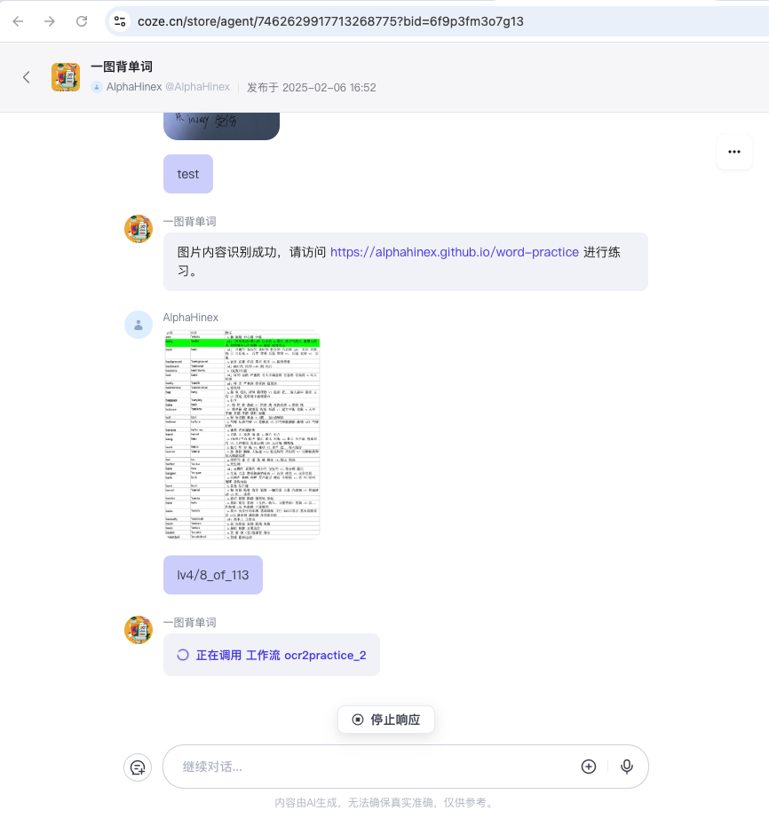
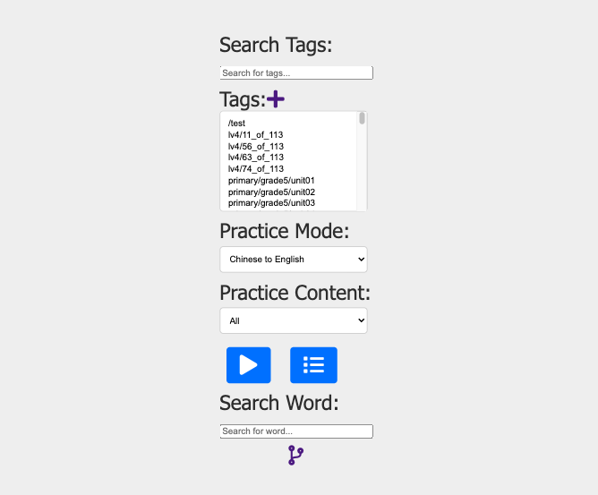
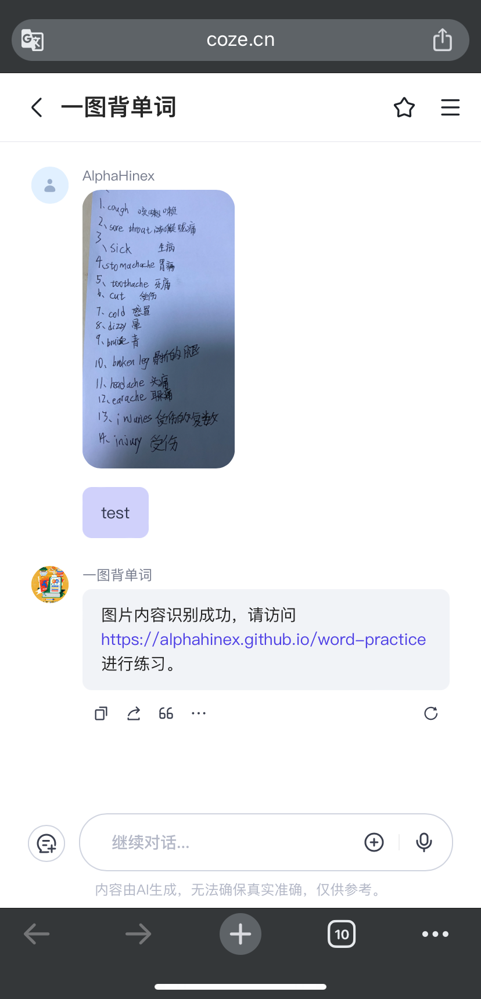
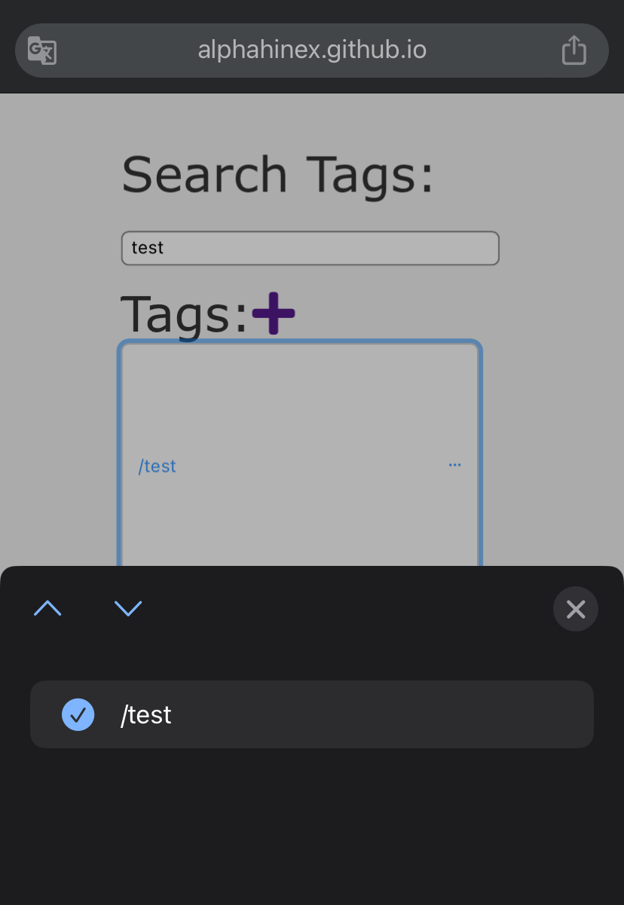
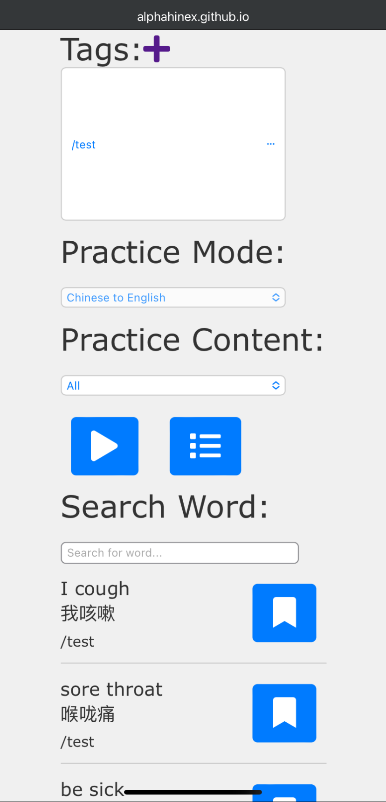
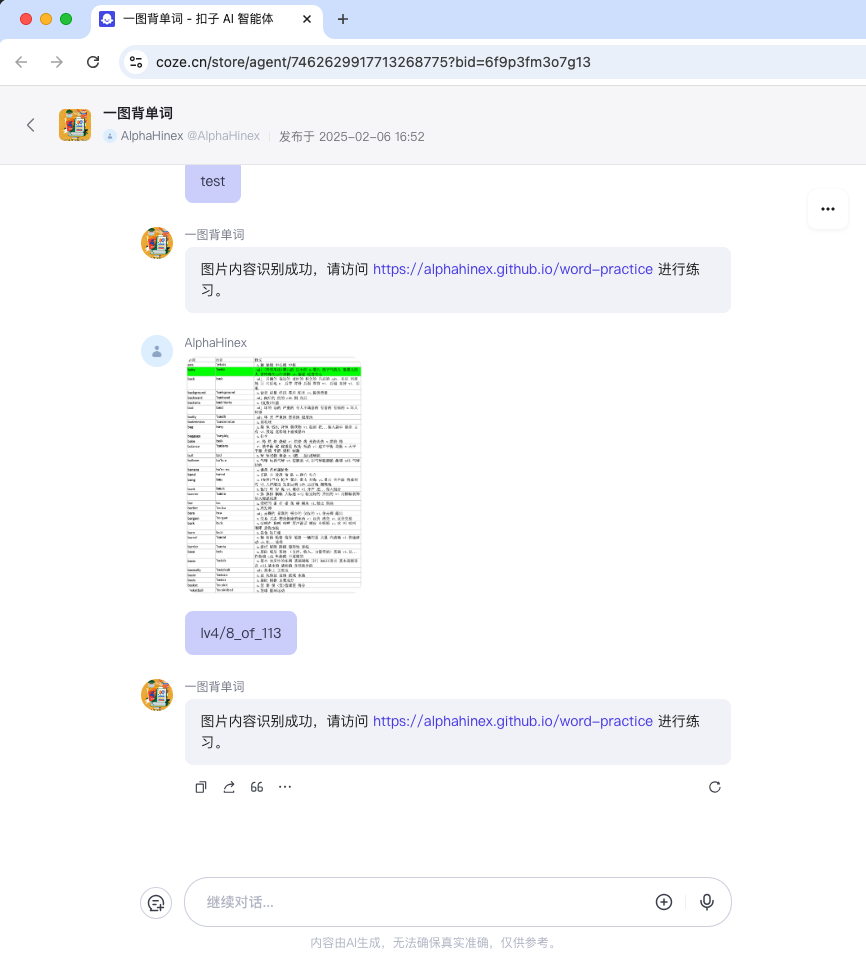
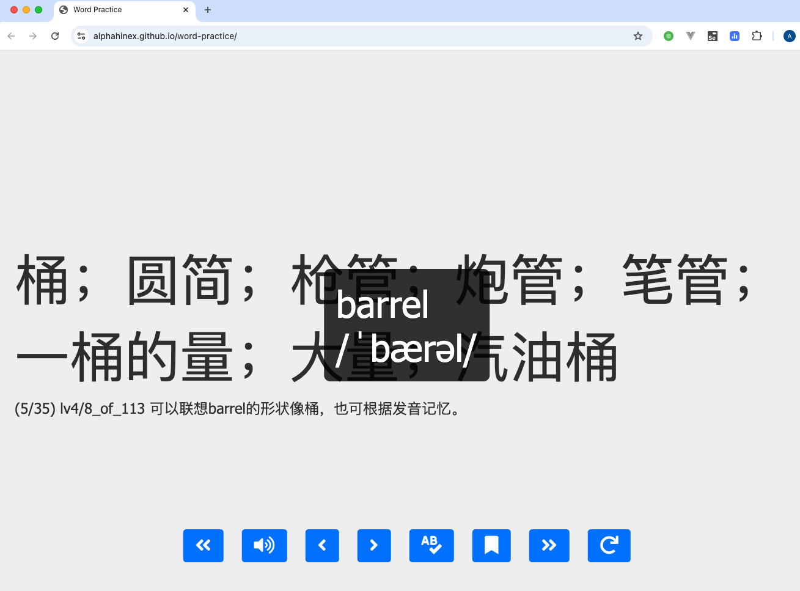

README
======

拍摄一张包含英文单词（词组、句子）的图片，通过 [扣子](https://www.coze.cn/) 中的智能体：[一图背单词](https://www.coze.cn/store/agent/7462629917713268775?bid=6f44r173g4018) 上传并设定 tag，之后在 [word-practice](https://alphahinex.github.io/word-practice) 中进行随机练习。







## 示例 1

手写要练习的单词（手写体识别效果依据清晰程度有所区别），手机拍照后访问 [一图背单词](https://www.coze.cn/store/agent/7462629917713268775?bid=6f44r173g4018) 将其上传，设定 tag 为 `test`：



**`一图背单词` 智能体中涉及多次大模型调用，因此执行时间较长，请耐心等待。**

智能体流程执行结束后，稍等片刻，即可进行练习：






## 示例 2

以 [大学英语四六级词汇完整版带音标（PDF下载版）](https://cet4-6.xdf.cn/201907/10954262.html) 中的 [大学英语四级词汇完整版带音标.pdf](https://file.xdf.cn/uploads/190703/675_190703172307eGJFooNR6JJMpUSB.pdf) 为例，截取其中某页图片，设定 tag 为 `lv4/8_of_113`：



智能体流程执行结束后，稍等片刻，即可进行练习：




## 功能清单

- 标签（tag）过滤、多选
- 两种练习模式：汉译英、英译汉
- 练习内容：全部练习、仅练习添加书签的单词
- 随机序练习
- 列表浏览所选标签内所有单词
- 模糊检索单词存在于哪些标签中
- 浏览器语音合成朗读单词
- 添加书签（页面刷新后书签重置）


## 手动勘误

从图片中识别的单词，都会以 `json` 格式存储到 https://github.com/AlphaHinex/word-practice/tree/main/words 路径下，tag 中的 `/` 可用来表示子文件夹，如：

`abc/test1`、`abc/test2`、`def/test`、`test` 四个 tag 对应 `words` 路径下的子路径及文件为：

```text
└── words
    ├── abc
    │   ├── test1.json
    │   └── test2.json
    ├── def
    │   └── test.json
    └── test.json
```

对于智能体识别出错的内容，可在 [word-practice](https://alphahinex.github.io/word-practice) 仓库中找到对应的文件，修改后提交 PR 以更新。
